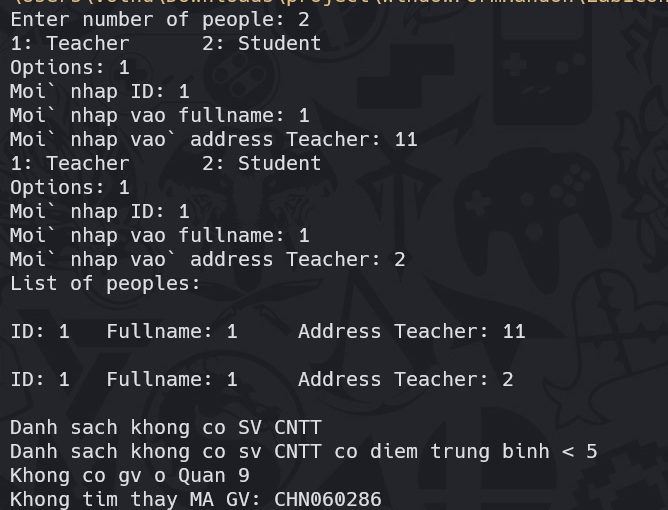
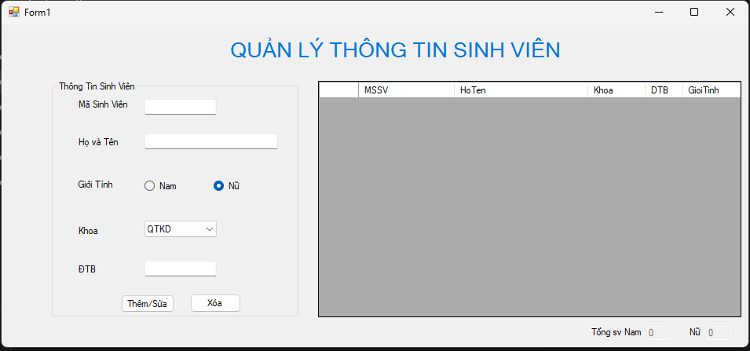

# WindowFormHandOn

C# is a object oriented programming language, the power that is well as developed by Microsoft, C # is the start section for their .NET plan.
If you want you to start learn c# or review c# this repo for you. Repo has a lot of exercises from easy to hard.

We have a tutorial about Winform(C#) with 7 steps:

1. Console app
2. Programing basic window form
3. Programing window form connect database
4. Programing window form with MDI
5. Programing window form with Report
6. Programing window form exam
7. Window form Project
---
Give me a star to suppport.
## Console app

### Student Management - Lab01

| Requirement                                                  | Result                                                       |
| ------------------------------------------------------------ | ------------------------------------------------------------ |
|  |  |

### School Management - Lab02

| Requirement                                                  | Result                                                       |
| ------------------------------------------------------------ | ------------------------------------------------------------ |
|  |  |

### NhaDatManagement - Lab04

| Requirement                                                  | Result |
| ------------------------------------------------------------ | ------ |
|  |        |

### Science Management - Exercise1_ScientistsManagement

| Requirement                                                  | Result                                                       |
| ------------------------------------------------------------ | ------------------------------------------------------------ |
| nhan vien(hoten, nam sinh, bằng cấp, chức vụ)- tongluong - nhap - xuat nhà quản lý(số ngày công trong tháng, bậc lương) nhakhoahoc(sobaibao, ) |  |

### BeeGame** - Exercise2_BeeGame

|                                                              |                                                              |
| ------------------------------------------------------------ | ------------------------------------------------------------ |
|  |  |

## Programing basic window form

### Calculator

| **Requirement**                                              | Result                                                       |
| ------------------------------------------------------------ | ------------------------------------------------------------ |
| Example:  |  |

### Student management

- Quản lý thông tin sinh viên cần lưu trữ các thông tin sau: Mã số sinh viên, Họ Tên, Giới Tính,  Điểm Trung Bình và Tên Khoa. Thiết kế chương trình quản lý thông tin sinh viên như sau:Có 3 khoa được đưa vào comboBox (QTKD, CNTT, NNA).  

  - 2.1 Khi mới Load Form - Khoa được chọn mặc định là QTKD. Giới tính Nữ mặc định được checked. Tổng số sinh viên  Nam/Nữ đều là 0. 

  - 2.2 Khi nhấn vào nút “Thêm/Sửa” - Kiểm tra các thông tin bắt buộc phải nhập liệu cho sinh viên như mã sinh viên, tên, và điểm  trung bình. Nếu để trống sẽ xuất hiện thông báo lỗi “Vui lòng nhập đầy đủ thông tin!”. - Nếu mã số sinh viên vừa nhập chưa có ở trong DataGridView (bên phải) thì Thêm mới dữ  liệu sinh viên vừa nhập vào DataGridView, và thông báo “Thêm mới dữ liệu thành công!” Nếu đã có MSSV trong DataGridView thì Cập nhật dữ liệu sinh viên vào DataGridView, và  thông báo “Cập nhật dữ liệu thành công!” 

  - 2.3 Khi nhấn vào nút “Xóa” - Kiểm tra nếu MSSV cần xóa không tồn tại trong DataGridView thì thông báo lỗi “Không  tìm thấy MSSV cần xóa!”. - Ngược lại thì xuất hiện cảnh báo YES/NO. Nhấn YES sẽ thực hiện xóa dòng dữ liệu sinh  viên trong DataGridView và thông báo “Xóa sinh viên thành công!”.  

  - 2.4 Viết code cho sự kiện ở DataGridView, người dùng chọn 1 dòng thì thể hiện ngược lại thông tin  của các sinh viên đã chọn ở phần nhập liệu (bên trái). 

  - 2.5 Tính toán lại số sinh viên Nam, Nữ phù hợp với các ngữ cảnh khi thay đổi dữ liệu

### Exercise3_CinemaTicketManagent

Rạp có 3 hàng ghế, mỗi hàng có 5 ghế, các ghế được đánh số từ 1 đến 15 và được phân thành 3 dãy như (hình trên): Giá vé lô A 5000/vé Giá vé lô B 6500/vé Giá vé lô C 8000/vé

Trên Form trình bày một sơ đồ các chổ ngồi để người sử dụng chọn vị trí muốn mua. Trên sơ đồ này  cũng thể 
hiện những vị trí đã bán vé và những vị trí chưa bán vé bằng cách thể hiện màu khác nhau  (ghế chưa bán vé 
màu trắng, ghế đã bán vé màu vàng). Khi người sử dụng click chuột tại một vị trí trên sơ đồ thì: 

- Nếu đây là vị trí chưa bán vé thì đổi màu của vị trí này sang màu xanh để cho biết đây là vị trí đang chọn. 
- Nếu đây là vị trí đang chọn (có màu xanh) thì đổi màu của vị trí này trở về màu trắng 
- Nếu đây là một vị trí đã bán vé (có màu vàng) thì xuất hiện một Message box thông báo cho  người sử dụng biết vé ở vị trí này đã 
  được bán. Sau khi đã chọn các vị trí người sử sụng có  thể click chuột vào nút CHỌN hoặc HỦY BỎ Nếu click vào nút CHỌN thì: 

- Đổi màu các vị trí đã chọn (màu xanh) trên sơ đồ sang màu vàng (cho biết vị trí đã bán vé) 
- Xuất lên một Label tổng số tiền phải trả cho số vé đã mua (phụ thuộc vào các vị trí đã  chọn) Nếu click vào nút HỦY BỎ thì: 
- Đổi màu các vị trí đã chọn (màu xanh) trên sơ đồ sang màu trắng trở lại 
- Xuất lên Label giá trị 0

| screen 1                                                     | screen 2                                                     |
| ------------------------------------------------------------ | ------------------------------------------------------------ |
|  |  |

### Account management

- Quản lý thông tin tài khoản cần lưu trữ các thông tin sau: số tài khoản, tên khách hàng, địa chỉ  khách hàng và số tiền trong tài khoản. Thiết kế chương trình quản lý thông tin tài khoản cho một ngân  hàng tương tự như sau:

- 4.1 Khi nhấn vào nút “Thêm/Cập Nhật” - Kiểm tra các thông tin bắt buộc phải nhập liệu cho số tài khoản, tên, địa chỉ và số tiền. Xuất  hiện thông báo lỗi “Vui lòng nhập đầy đủ thông tin!”. - Nếu chưa có dữ liệu số tài khoản trong ListView thì Thêm mới dữ liệu nhập vào ListView,  tính lại tổng tiền và thông báo “Thêm mới dữ liệu thành công!” Nếu đã tồn tại số tài khoản trong ListView thì Cập nhật dữ liệu vào ListView và tính lại tổng  tiền và thông báo “Cập nhật dữ liệu thành công!” 

- 4.2 Khi nhấn vào nút “Xóa” - Kiểm tra nếu số tài khoản cần xóa tồn tại trong ListView , thì xuất hiện cảnh báo YES/NO  Nhấn YES sẽ thực hiện xóa dòng dữ liệu tài khoản trong ListView và thông báo “Xóa tài  khoản thành công!”.  - Nếu số tài khoản cần xóa không tồn tại thì thông báo lỗi “Không tìm thấy số tài khoản cần  xóa!”. 4.3 Viết code cho sự kiện ở ListView khi người dùng chọn 1 dòng thì thể hiện ngược lại ở phần  nhập liệu đúng thông tin trên.

  

### Dental bill

## Programing window form connect database

Student_And_ShippingManagement

### Student Management

    
CODE SQL - Student  management

  

<code>
Create database QuanLySinhVien
go
use QuanLySinhVien
Create table Student
(
    StudentID NVARCHAR(20) PRIMARY KEY,
    Fullname NVARCHAR(200),
    AverageScore float,
    FacultyID int
)
Create table Faculty
(
    FacultyID int PRIMARY KEY,
    FacultyName NVARCHAR(200)
)
</code>

**Requirement**

1. Sự kiện Form_load:
   - Hiển thị danh sách các sinh viên đang có trong CSDL ( Lấy từ bảng sinh viên )
   - ComboBox Khoa lấy từ bảng Faculty và hiện thị tên khoa
2. Khi nhấn vào nút “Thêm” Hoặc “Sửa”

   - Kiểm tra các thông tin bắt buộc phải nhập liệu cho sinh viên như mã sinh viên, tên, và điểm 
   trung bình. Nếu để trống sẽ xuất hiện thông báo lỗi “Vui lòng nhập đầy đủ thông tin!”
   - Kiểm tra mã số sinh viên phải có 10 kí tự. Nếu không sẽ xuất thông báo “Mã số sinh viên 
   phải có 10 kí tự!”
   - Nếu trường hợp nhấn vào nút “Thêm” thì Thêm mới dữ liệu sinh viên vừa nhập vào CSDL, 
   Load lại DataGridView, và thông báo “Thêm mới dữ liệu thành công!”. 
   Nếu trường hợp nhấn vào nút “Sửa”. Nếu mã sinh viên đã tồn tại thì Cập nhật dữ liệu sinh 
   viên vào CSDL, và thông báo “Cập nhật dữ liệu thành công!”. Nếu mã sinh viên đó không 
   tồn tại thì xuất thông báo “Không tìm thấy MSSV cần sửa!”
   - Reset lại dữ liệu về giá trị ban đầu sau khi thêm/ sửa thành công
3. Khi nhấn vào nút “Xóa”

   - Kiểm tra nếu MSSV cần xóa không tồn tại trong CSDL thì thông báo lỗi “Không tìm thấy 
   MSSV cần xóa!”.
   - Ngược lại thì xuất hiện cảnh báo YES/NO. Nhấn YES sẽ thực hiện xóa dòng dữ liệu sinh 
   viên trong DataGridView và thông báo “Xóa sinh viên thành công!”. 
   - Reset lại dữ liệu về giá trị ban đầu sau khi xóa thành công
4. Viết code cho sự kiện ở DataGridView, người dùng chọn 1 dòng thì thể hiện ngược lại thông tin 
   của các sinh viên đã chọn ở phần nhập liệu (bên trái).
5. 

| Form manage                                                  | Form Manage faculity                                         | form search                                                  |
| ------------------------------------------------------------ | ------------------------------------------------------------ | ------------------------------------------------------------ |
|  |  |  |

### Shipping management

    
CODE SQL - Shipping management

  

<code>
Create database QLDonHang
go
USE QLDonHang
GO
/****** Object: Table [dbo].[Invoice] Script Date: 07/04/2020 23:13:15
******/
SET ANSI_NULLS ON
GO
SET QUOTED_IDENTIFIER ON
GO
CREATE TABLE [dbo].[Invoice](
[InvoiceNo] [nvarchar](20) NOT NULL,
[OrderDate] [datetime] NOT NULL,
[DeliveryDate] [datetime] NOT NULL,
[Note] [nvarchar](255) NULL,
CONSTRAINT [PK_Invoice] PRIMARY KEY CLUSTERED
(
[InvoiceNo] ASC
)WITH (PAD_INDEX = OFF, STATISTICS_NORECOMPUTE = OFF, IGNORE_DUP_KEY = OFF,
ALLOW_ROW_LOCKS = ON, ALLOW_PAGE_LOCKS = ON) ON [PRIMARY]
) ON [PRIMARY]
GO
/****** Object: Table [dbo].[Product] Script Date: 07/04/2020 23:13:15
******/
SET ANSI_NULLS ON
GO
SET QUOTED_IDENTIFIER ON
GO
CREATE TABLE [dbo].[Product](
[ProductID] [nvarchar](20) NOT NULL,
[ProductName] [nvarchar](100) NOT NULL,
[Unit] [nvarchar](20) NOT NULL,
[BuyPrice] [decimal](18, 0) NULL,
[SellPrice] [decimal](18, 0) NULL,
CONSTRAINT [PK_Product] PRIMARY KEY CLUSTERED
(
[ProductID] ASC
)WITH (PAD_INDEX = OFF, STATISTICS_NORECOMPUTE = OFF, IGNORE_DUP_KEY = OFF,
ALLOW_ROW_LOCKS = ON, ALLOW_PAGE_LOCKS = ON) ON [PRIMARY]
) ON [PRIMARY]
GO
/****** Object: Table [dbo].[Order] Script Date: 07/04/2020 23:13:15 ******/
SET ANSI_NULLS ON
GO
SET QUOTED_IDENTIFIER ON
GO
CREATE TABLE [dbo].[Order](
[InvoiceNo] [nvarchar](20) NOT NULL,
[No] [int] NOT NULL,
[ProductID] [nvarchar](20) NOT NULL,
[ProductName] [nvarchar](100) NULL,
[Unit] [nvarchar](20) NULL,
[Price] [decimal](18, 0) NOT NULL,
[Quantity] [int] NOT NULL,
CONSTRAINT [PK_Order] PRIMARY KEY CLUSTERED
(
[InvoiceNo] ASC,
[No] ASC
)WITH (PAD_INDEX = OFF, STATISTICS_NORECOMPUTE = OFF, IGNORE_DUP_KEY = OFF,
ALLOW_ROW_LOCKS = ON, ALLOW_PAGE_LOCKS = ON) ON [PRIMARY]
) ON [PRIMARY]
GO
/****** Object: ForeignKey [FK_Order_Invoice] Script Date: 07/04/2020
23:13:15 ******/
ALTER TABLE [dbo].[Order] WITH CHECK ADD CONSTRAINT [FK_Order_Invoice] FOREIGN
KEY([InvoiceNo])
REFERENCES [dbo].[Invoice] ([InvoiceNo])
GO
ALTER TABLE [dbo].[Order] CHECK CONSTRAINT [FK_Order_Invoice]
GO
/****** Object: ForeignKey [FK_Order_Product] Script Date: 07/04/2020
23:13:15 ******/
ALTER TABLE [dbo].[Order] WITH CHECK ADD CONSTRAINT [FK_Order_Product] FOREIGN
KEY([ProductID])
REFERENCES [dbo].[Product] ([ProductID])
GO
ALTER TABLE [dbo].[Order] CHECK CONSTRAINT [FK_Order_Product]
GO
USE QLDonHang
GO
/****** Object: Table [dbo].[Invoice] Script Date: 07/04/2020 23:14:16
******/
INSERT [dbo].[Invoice] ([InvoiceNo], [OrderDate], [DeliveryDate], [Note]) VALUES
(N'HDX001', CAST(0x0000AAD900000000 AS DateTime), CAST(0x0000AADA00000000 AS
DateTime), ' Giao trước 9h')
INSERT [dbo].[Invoice] ([InvoiceNo], [OrderDate], [DeliveryDate], [Note]) VALUES
(N'HDX002', CAST(0x0000AADA00000000 AS DateTime), CAST(0x0000AADA00000000 AS
DateTime), N'Gọi điện trước khi giao')
INSERT [dbo].[Invoice] ([InvoiceNo], [OrderDate], [DeliveryDate], [Note]) VALUES
(N'HDX003', CAST(0x0000AADA00000000 AS DateTime), CAST(0x0000AADC00000000 AS
DateTime), N'giao tu 1-3h')
/****** Object: Table [dbo].[Product] Script Date: 07/04/2020 23:14:16
******/
INSERT [dbo].[Product] ([ProductID], [ProductName], [Unit], [BuyPrice],
[SellPrice]) VALUES (N'Product1', N'Sản phẩm 1', N'Cái', CAST(100000 AS
Decimal(18, 0)), CAST(120000 AS Decimal(18, 0)))
INSERT [dbo].[Product] ([ProductID], [ProductName], [Unit], [BuyPrice],
[SellPrice]) VALUES (N'Product2', N'Sản phẩm 2', N'Cái', CAST(90000 AS
Decimal(18, 0)), CAST(120000 AS Decimal(18, 0)))
INSERT [dbo].[Product] ([ProductID], [ProductName], [Unit], [BuyPrice],
[SellPrice]) VALUES (N'Product3', N'Sản phẩm 3', N'Cái', CAST(40000 AS
Decimal(18, 0)), CAST(70000 AS Decimal(18, 0)))
INSERT [dbo].[Product] ([ProductID], [ProductName], [Unit], [BuyPrice],
[SellPrice]) VALUES (N'Product4', N'Sản phẩm 4', N'Hộp', CAST(200000 AS
Decimal(18, 0)), CAST(300000 AS Decimal(18, 0)))
/****** Object: Table [dbo].[Order] Script Date: 07/04/2020 23:14:16 ******/
INSERT [dbo].[Order] ([InvoiceNo], [No], [ProductID], [ProductName], [Unit],
[Price], [Quantity]) VALUES (N'HDX001', 1, N'Product1', N'Sản phẩm 1', N'Cái',
CAST(120000 AS Decimal(18, 0)), 20)
INSERT [dbo].[Order] ([InvoiceNo], [No], [ProductID], [ProductName], [Unit],
[Price], [Quantity]) VALUES (N'HDX001', 2, N'Product2', N'Sản phẩm 2', N'Cái',
CAST(120000 AS Decimal(18, 0)), 4)
INSERT [dbo].[Order] ([InvoiceNo], [No], [ProductID], [ProductName], [Unit],
[Price], [Quantity]) VALUES (N'HDX001', 3, N'Product4', N'Sản phẩm 4', N'H p',
CAST(300000 AS Decimal(18, 0)), 10)
INSERT [dbo].[Order] ([InvoiceNo], [No], [ProductID], [ProductName], [Unit],
[Price], [Quantity]) VALUES (N'HDX002', 1, N'Product4', N'Sản phẩm 1', N'H p',
CAST(300000 AS Decimal(18, 0)), 10)
INSERT [dbo].[Order] ([InvoiceNo], [No], [ProductID], [ProductName], [Unit],
[Price], [Quantity]) VALUES (N'HDX002', 2, N'Product2', N'Sản phẩm 3', N'Cái',
CAST(300000 AS Decimal(18, 0)), 12)
INSERT [dbo].[Order] ([InvoiceNo], [No], [ProductID], [ProductName], [Unit],
[Price], [Quantity]) VALUES (N'HDX003', 1, N'Product1', N'S n ph m 1', N'Cái',
CAST(120000 AS Decimal(18, 0)), 40)
INSERT [dbo].[Order] ([InvoiceNo], [No], [ProductID], [ProductName], [Unit],
[Price], [Quantity]) VALUES (N'HDX003', 4, N'Product2', N'Sản phẩm 2', N'Cái',
CAST(120000 AS Decimal(18, 0)), 60)
</code>

**Requirement**

Khi load Form  
- Thời gian giao hàng được thể hiện trong ngày hiện hành và tự động tìm kiếm dữ liệu có Hóa  Đơn phát sinh trong ngày hiện hành này

- Người dùng có thể thay đổi thời gian giao hàng trong 1 khoảng thời gian bất kì, khi đó dữ  liệu cũng được tự động thay đổi theo 

- Khi check vào CheckBox Xem tất cả trong tháng, thì thời gian giao hàng sẽ được thể hiện từ  ngày đầu tháng hiện hành đến cuối tháng và hiện thị thông tin ở dướI

### Cinema Ticket Management(** HARD ONE)

| Login form                                                   | buy ticket Form                                              | Order form                                                   | Add customer                                                 | Main form                                                    |
| ------------------------------------------------------------ | ------------------------------------------------------------ | ------------------------------------------------------------ | ------------------------------------------------------------ | ------------------------------------------------------------ |
|  |  |  |  |  |

## Programing window form with MDI(too easy not really important)

**Requirement**

- Design interface and use *ToolStrip* and *MenuStrip*

## Programing window form with Report

### code report for student management in "*connect database*"

### Product report

| check box 1                                                  | check box 2                                                  | result                                                       |
| ------------------------------------------------------------ | ------------------------------------------------------------ | ------------------------------------------------------------ |
|  |  |  |

Viết chương trình để xem thông tin 2 loại Data Report như sau - Xem bảng báo giá sản phẩm: Lấy thông tin từ bảng Product và hiện thị report data - Xem phiếu giao hàng của 1 hóa đơn: Kết hợp Invoice và Order

## Order bill data report

## Programing window form  exam

*Read more in pdf file*

### Charity Management

| Form Transaction                                             | MDI feature                                                  | Message box feature                                          | Report                                                       |
| ------------------------------------------------------------ | ------------------------------------------------------------ | ------------------------------------------------------------ | ------------------------------------------------------------ |
|  |  |  |  |

### Student Management

### Soft drink Management

### COVID-19 test management

| Form Management                                              | sort feature                                                 | message box                                                  | report                                                       |
| ------------------------------------------------------------ | ------------------------------------------------------------ | ------------------------------------------------------------ | ------------------------------------------------------------ |
|  |  |  |  |

## Window form some Project

### Twoone - Film management 

https://github.com/truongnhon-hutech/TwooneWinform

## Reference
TienNguyen : [Her repo](https://github.com/thuytien007/bao-mat-thong-tin)
Hutech document

## Author
Võ Thương Trường Nhơn

# Supporting the Development of this repository
- Star this repo for more people know 
- Create new merge request

